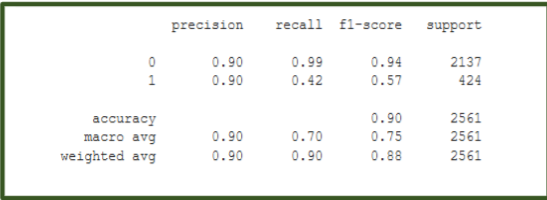
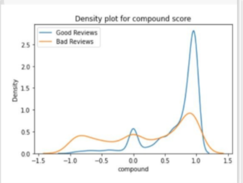

# Sentiment-Analysis-Of-Product-Reviews
The objective of the project is to build a supervised learning model to polarize large amounts of reviews of any generic product , and categorize the feedbacks of the customers into Positive and Negative sets.

### [_What is Sentiment Analysis ?_](https://towardsdatascience.com/sentiment-analysis-concept-analysis-and-applications-6c94d6f58c17)

Sentiment analysis is contextual mining of text which identifies and extracts subjective information in source material, and helping a business to understand the social sentiment of their brand, product or service while monitoring online conversations. However, analysis of social media streams is usually restricted to just basic sentiment analysis and count based metrics.

#### Objective :
For selecting a product, a customer needs to go through thousands of reviews to understand a product. But in this prospering day of machine learning, going through thousands of reviews would be much easier if a model is used to polarize those reviews and learn from it. We have used Random Forest Classifier method on the review dataset and have got satisfactory accuracy.

### Work - Flow Diagram of the Project :

### _During the pre-processing stage of the datasest , the wordcloud formed is :_

### Sentiment Intensity Analyzer function is being used from Vader to perform sentiment analysis of the review text.

### Classification Report :

_The accuracy of the model is 90% (approx.) :_

### Density Plot : 

where (0 - 0.8267 , 1 - 0.173)

_Happy learning , Kudos !!_

